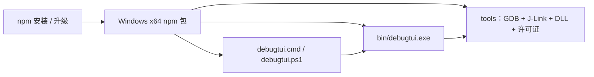
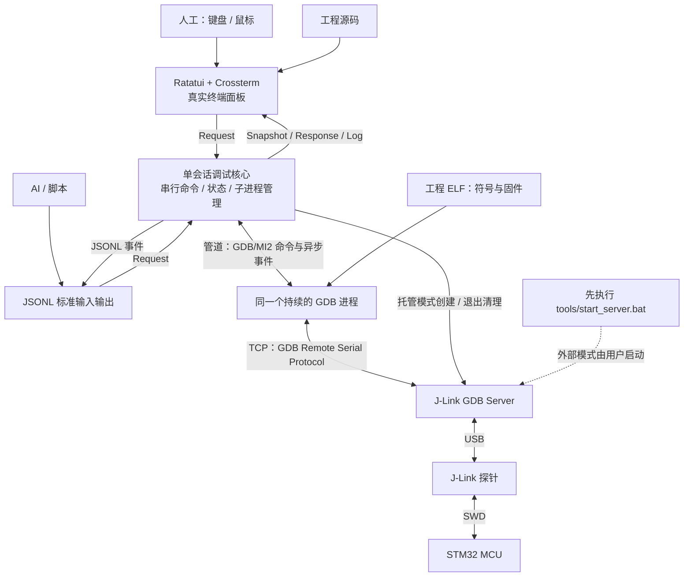
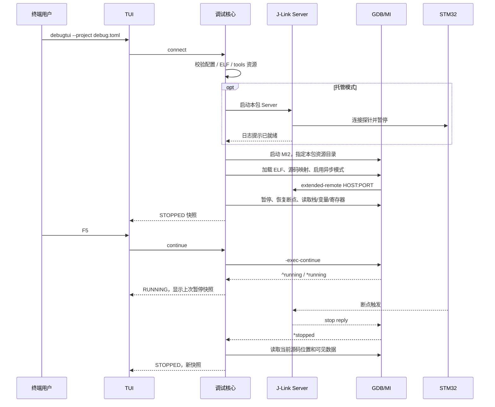

# DebugTUI 架构

## 分发与运行

包内附带预编译的原生程序和最小工具集，不使用 postinstall 下载、Python、浏览器服务或 Node 常驻进程。npm 负责版本管理。Rust/MinGW 仅用于开发构建，不是安装端依赖。

## 上下游与数据流

人工和 AI 调用同一份核心逻辑、使用相同调试方法。目前两者是不同启动模式，不支持同时加入一个正在运行的会话，也不能同时用两个 GDB 抢占探针。

## 启动时序

普通连接不下载。用户执行 `:download` 并确认后才写入 ELF。`continue` / `step` 请求完成只表示动作已提交，实际暂停由异步停止事件确认。运行中暂停通过 MI `-exec-interrupt`，不依赖模拟 Ctrl+C 信号。

## 模块与边界

| 模块 | 责任 |
|---|---|
| `main.rs` | CLI 参数、JSONL 输入输出、脚本失败与退出码 |
| `ui.rs` | 终端生命周期、面板、输入、源码和有限长度日志 |
| `session.rs` | 单 GDB 会话、MI 请求编号、异步事件、调试状态和快照 |
| `mi.rs` | MI 嵌套记录及转义解析，保留重复字段 |
| `config.rs` | TOML 校验、相对路径、源码映射、偏好保存 |
| `process.rs` | Windows Job Object，清理本程序的子进程 |

界面按事件更新、最多每 25 ms 绘制一次；闲置不重绘。MI 记录上限 1 MiB；日志队列、界面日志、监视表达式、内存读取与源码加载都有上限。整个调试核心只有一个拥有 GDB 的工作线程，读管道线程用于防止 stdout/stderr 堵塞，不另设网络守护进程。

正常退出：运行中的目标先暂停，清除会话断点，恢复目标运行，detach，关闭 GDB 与托管 Server。异常强制结束时 Job Object 负责子进程回收；无法承诺目标状态，重新连接后确认。外部服务由其自身的退出策略决定生命周期。

## 第一版范围

已实现源码浏览、断点、硬件观察点、源码/指令单步、监视表达式、局部变量、调用栈、寄存器、内存、反汇编、GDB 控制台、下载、外部构建、会话日志和 JSONL 自动化。

结构体/数组可通过 GDB 表达式查看成员，目前没有变量树展开；源码编辑器、SVD 外设位域、FreeRTOS 专项任务面板、多客户端共享会话和跨平台工具包是后续扩展。

实现依据：[Ratatui](https://ratatui.rs/)、[GDB/MI](https://sourceware.org/gdb/current/onlinedocs/gdb.html/GDB_002fMI.html)、[npm bin](https://docs.npmjs.com/cli/v11/configuring-npm/package-json/#bin)、[Windows Job Objects](https://learn.microsoft.com/en-us/windows/win32/procthread/job-objects)。
