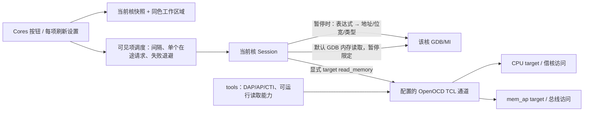
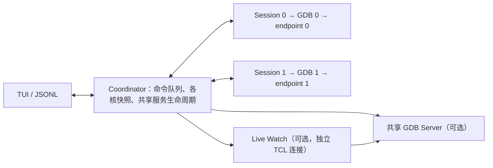

# DebugTUI 架构

## 0.8.1 断点管理

`ui/breakpoints.rs` 提供勾选开关、代码/数据断点编辑器、条件、忽略次数及当前核批量启停。UI 不预先修改快照，等待工作线程重新查询 GDB；一次只发送一个面板修改请求，输入框中的 Delete 不会删除断点。核心切换关闭旧编辑器，列表按 GDB 编号保留选择位置。

`session/breakpoints.rs` 使用标准 MI：`-break-insert`（含 `-h/-t/-d/-c/-i`）、`-break-watch`（写）、`-break-watch -r`（读）、`-break-watch -a`（读写）、`-break-enable/-disable/-condition/-after/-delete`。数据断点附加设置失败时删除刚创建的断点；编辑已有断点失败时尝试恢复原设置。失败后也查询实际状态，避免 UI 假成功。

Headless API 新增 `enable_break {number, enabled}` 或 `{all:true, enabled}`，`update_break {number, enabled?, condition?, ignore_count?}`。原 `break` 增加 `hardware/enabled/condition/ignore_count`；`data_break` 增加 `access: write|read|access` 及 `enabled/condition/ignore_count`。断点快照增加 condition、ignore_count、hit_count、address、pending、restore_error；旧字段保持兼容。

配置 `BreakpointSpec` 同时接受旧 location 字符串与详细对象。修改后立即通过原有偏好写锁合并至单核根列表或当前 `[[cores]]`，不写 tools。跨重连保存定义而非 GDB 编号；临时断点不恢复。无法恢复的数据断点保留为可见失败记录，允许重试或删除，不静默丢弃。硬件数量、读写范围和对齐由调试环境判断，TUI 没有芯片断点表。

等待暂停时，少数远程 GDB 会在运行中拒绝 `-thread-info`。对这一明确错误继续等待异步停止事件，沿用原有超时；不隐式重新连接或把运行目标标成已停止。

## 0.8 核心导航与显式内存通道

- `ui/cores.rs`：稳定核序号选色、核心状态按钮和溢出切换；Source/Asm 与右侧检查区加同色底色和边线。核心变化令按需视图缓存、外设值及实时采样失效，停止快照与运行采样不会混写。
- `ui/monitor.rs`：策略按核心 + 数据项保存到 `Ui.refresh`；Watch 树根策略可继承，子项可覆盖。采样只针对可见标量/展开成员，单个请求在途、候选公平轮转，用户动作和补全优先。响应携带本地核心身份与 generation 校验，切核/重连后迟到结果丢弃。错误至少 1 秒退避，频率非硬实时保证。
- `session/memory.rs`：`watch_resolve` 创建短寿命 GDB 变量对象取成员路径、地址、类型信息并释放，读取目标 ELF/PE 字节序。`memory_read` 默认复用停止时 GDB 内存读取；命名通道使用显式目标 TCL 读取并校验当前核、运行能力、宽度、对齐、响应和超时。每通道按需复用一个 TCP，故障/断开关闭。64 位采用两次 32 位读取；不保证原子性。
- `memory_access` 和 `sync` 可放环境文件；工程优先覆盖。AP 号/CTI 映射仅存在于板级脚本，TUI 不配置隐式硬件触发或推断缓存一致性。运行态直读不发任何 GDB 指令，不改变全局 OpenOCD selected target，不隐式 halt/resume。
- 单核只配置 `memory_access` 时仍直接走原 Session，不增加协调线程。`live_watch` 旧日志通道保持兼容，新面板默认关闭轮询，无需该后台功能。

## 多核调度（0.7.2）

没有 `cores/live_watch/sync` 时直接创建原 Session，不引入 Coordinator 线程。显式 cores 的数组位置是稳定的核序号；startup_order 仅决定全局启动命令的执行顺序。

Coordinator 将用户请求 ID 与内部逐核请求 ID 分离，每次只等待一个子请求，收齐结果后回复原请求。当前核的命令保持原 result 结构，全局命令带 `results[]`（含核索引、名字、成功与错误），后台核出错不会被忽略。子通道退出或响应逾时转为有界错误，退出取消标记向全部 Session 传递。

各核 Snapshot 分别缓存；输出当前核快照附带 `core` / `cores` 元数据，切核更新 generation、标题 endpoint 和按需视图缓存。后台核停止时更新状态，不覆盖当前核的寄存器或源码。每核 MI 日志在 `core-N/`，共享服务日志在 `coordinator/`。

配置文件写入串行合并，Watch/断点写回指定 core，空数组与继承顶层配置含义不同。启动页保存允许运行时这些列表变化，仍检测真正的配置冲突。

全局连接失败执行 disconnect 回滚再清理自有服务；Run 的部分成功显式返回，不声称硬件原子同步。外部 Build/Download 释放整个工作区的 GDB 和自有服务，成功后恢复连接。芯片 reset、CTI 和共享内存/缓存策略仍由环境配置决定。

## 边界

~~~mermaid
flowchart LR
    U["人工 TUI / AI JSONL"] <--> C["通用会话核心"]
    C <-->|"GDB/MI2"| G["用户选择的 GDB"]
    G <-->|"远程协议"| S["外部调试服务"]
    S <--> T["目标芯片"]
    G <--> L["本机程序"]
    E["tools 环境配置"] -->|"启动参数与动作"| C
    C -.->|"可选通用进程启动"| S
~~~

核心没有芯片、探针品牌、寄存器白名单或预设 monitor 命令。GDB 路径、资源目录、服务程序、就绪标记、连接方式和特殊动作由配置决定。tools 是可选环境层，可以来自另一个目录或仓库。

环境文件是数据驱动的通用协议：核心只知道如何启动命令、等待配置声明的就绪标记、发送配置声明的 GDB 命令。STM32/J-Link 具体内容集中在 tools/debug-env.toml。不配置服务时只启动 GDB。

## 启动与状态

无参数启动先进入 TUI 配置页，不启动 GDB 或占用探针。CLI 参数和界面编辑使用同一份项目文档模型；参数完整时可以直接连接，--setup 强制先进入配置页。工程目录中的 tools/debug-env.toml 可以自动发现，TUI 安装目录不作为工具查找路径。

配置页顶部固定放置 Start debugging / Save / Workspace，默认聚焦启动；鼠标、Enter、Ctrl+R、Ctrl+Enter、F5 共用启动校验。主界面的 Project 栏提供 ← Setup，F2 仍可使用。返回配置保留活动会话，Workspace / Esc 保留编辑草稿并回到原工作区。启动动作提交正在编辑的字段并校验输入后，向旧会话发送 quit，等待清理响应和 Exit，再保存项目、清空旧核及监视面板状态、创建新会话并连接。清理失败时停止切换。配置浏览和输入不执行硬件命令。

1. 加载可选 tools 环境，合并项目字段，再应用 CLI 参数。
2. 校验通用配置及可选符号文件，不校验某个 tools 二进制目录布局。
3. 按需启动配置中的服务，读取 stdout/stderr 就绪标记；--connect/--local 跳过服务。
4. 启动指定 GDB，使用 MI2，通过管道交换命令与异步事件。
5. 加载可选符号和源码映射，执行 gdb.init。
6. 选择 remote/extended-remote 或保持 local，执行显式 after_connect。
7. 查询实际线程和栈状态；无运行目标为 READY，暂停为 STOPPED，运行中为 RUNNING。
8. 动态获取寄存器和面板数据。每个动作的实际停止由异步事件确认。

默认 run 使用 -exec-run；restart 与 GDB download 动作来自环境。跨架构差异由匹配目标的 GDB 处理。默认连接和退出不发送 monitor 命令。

项目 `[tasks]` 可配置 build / download 外部命令，启动页直接编辑；工作目录固定为 `program.source_root`。命令由系统 shell 在会话工作线程中执行，stdout/stderr 通过现有事件队列传到 Console。Windows 子进程归属独立 Job，退出/超时时清理。外部任务先释放已连接的 GDB / 自有服务，成功后重连以重新加载 ELF；失败保持断开。脚本下载优先于环境 GDB 下载动作；旧 `[build]` 作为兼容回退。主界面以独立 Project 工具栏呈现，不与调试执行控制混排。

Pause 先发送标准 MI interrupt，等待异步停止通知。超过 250 ms 未收到通知时，通过 -thread-info 核对线程状态；全部线程确认为 stopped 后才同步状态并读取栈、变量和寄存器。如果仍在运行，最多补发一次 interrupt，保留有界超时。GDB 报告“目标已停止”的中断竞争也走同一核对流程；不通过 reset、monitor 或重连伪造暂停成功。断开会话复用此暂停逻辑。开启 log_dir 时，日志同时记录 MI 异步事件以供诊断。

## 模块

| 文件 | 职责 |
|---|---|
| cli.rs | 启动参数解析、界面预填和直接启动选项 |
| launch.rs | 工程文档、启动表单、文件浏览器、相对路径保存 |
| config.rs | 项目/环境合并、相对路径、通用启动与动作配置 |
| session.rs | MI 请求队列、异步状态、通用进程管理、动态数据 |
| logging.rs | 日志捕获时间、单调会话计时、排他创建文件和逐行时间戳 |
| mi.rs | MI 记录和转义解析 |
| ui.rs | 输入、面板焦点、鼠标命中、视图按需请求和下载确认 |
| ui/render.rs | 双栏工作台、工具栏、滚动条、命令列表及窄终端布局 |
| theme.rs | 原生终端配色、分层面板、全行高亮、圆角弹窗及背景遮罩 |
| ui/highlight.rs | 轻量 C 类语法着色；缓存当前文件每行的注释起始状态，仅对可见行生成 Span |
| ui/source_tabs.rs | 源码文件标签、路径去重、独立浏览位置、溢出导航及可搜索的已打开文件列表 |
| main.rs | CLI 和 JSONL |
| process.rs | 宿主进程生命周期；Windows Job Object |
| tools/ | 可选工具、厂商配置、启动脚本和许可证 |

环境覆盖按字段合并，数组整体替换。相对启动路径基于定义该路径的文件，避免配置迁移后依赖启动目录。会话退出只保存项目的监视和断点。启动表单保存项目显式设置和环境引用，保留其余配置，不将整份已展开的环境配置写回项目；检测到外部修改启动设置时要求重新加载。

## 工作台交互

视觉层继续使用 Ratatui/Crossterm 的单元格差分输出，没有浏览器、GPU 画布、图片或字体依赖。调试等待状态最多每 250 ms 更新一次本地状态符号；无请求且无输入/会话事件时不绘制。悬停只更新 UI，不发送 GDB 请求。所有点击区域以实际绘制的终端字符宽度计算。弹窗先遮罩和清空区域，再绘制不透明面板，避免底层文字残留；PC、变化值和选择行背景明确铺满视口宽度。

主视图区保留 Source / Asm / Files / Log，右上检查区为 Regs / Stack / Memory / Breaks，右下变量区为 Watch / Locals。三组分别记录活动标签，每个视图记录浏览位置、内容区域和滚动条坐标。滚轮、拖动和键盘共享视口边界计算；Files / Stack 点击使用视口起始行定位，Log 浏览历史时暂停自动跟随，End 恢复跟随。Console 内固定输入框接收 GDB 原生命令及冒号前缀的工作台命令，复用同一 Request 分发与历史记录。版本标题来自 Cargo 包元数据。

Source 的打开文件集合与当前 GDB 栈帧分别维护。所有打开入口按映射后的规范文件路径去重；停止事件定位对应文件，手动切换只变更浏览视图。标签只保存路径和光标/滚动位置，源码文本只保留当前文件，切换时按需读取，单文件继续限制为 2 MiB / 30000 行。标签栏按终端字符宽度截断长名称，保留关闭按钮命中区域；新激活文件和窗口缩放会自动确保活动标签可见，翻页浏览不会改变活动文件。无源码位置的停止保留已有标签，但清空活动源码视图，避免显示旧位置。

Asm、Memory、Files 按可见性加载。Asm / Memory 使用停止代次、栈帧地址及层级作为刷新标识；等待在途命令完成后提交请求，避免复位尚未完成时查询旧 PC。GDB 异步停止或栈帧变化会清除旧内存/汇编快照。查询失败保留错误提示，显式 refresh 或下一次停止再重试，不进行高频轮询。

Reconnect 在会话核心中顺序执行 disconnect 和 connect；清理失败则停止，不隐式另开服务。工具栏的 Reset 使用现有环境 restart 配置，所有硬件差异继续由环境层决定。

## 退出与所有权

Console 和 Watch 使用独立输入缓冲区、共享补全弹窗。补全等待 150 ms 输入停顿后，经现有 Engine 通道发送 `complete` 请求；每次最多一个在途查询，回复按输入、焦点、会话状态、停止代次及前台命令失效标识匹配。工作台冒号命令本地匹配，GDB 命令和成员表达式使用 `-complete`，裸变量前缀使用 `-symbol-info-variables`。查询不会提交用户输入为执行命令；补全响应不进入普通 Console 日志，运行状态不查询符号。

TUI 只终止自己启动的 GDB/服务/构建进程。默认 detach；resume/disconnect 可配置。before_disconnect 在停止状态下执行。目标最终运行状态还受远端 detach、服务退出和探针策略影响，不由 UI 猜测。

Windows 使用 Job Object 清理意外终止后的自有进程。非 Windows 分支尚未提供同等级进程树回收，当前发行和实测范围为 Windows x64。

## 分发

- npm tgz / 便携 ZIP：TUI + 文档 + 本程序依赖许可证。
- tools ZIP：独立的 GDB、服务程序、配置和原厂许可证。
- Git：DebugTUI 源码和配置；应用 EXE 始终在 ignore 中。现有可选 tools 依赖继续单独维护。

人工和 AI 使用同一核心、同一协议。当前两者是不同启动模式，没有多客户端会话服务；运行时没有 Node/Python 常驻依赖。

## SVD peripheral view

`program.svd` belongs to the project and resolves relative to its configuration file. The startup UI and optional `--svd` argument select it. `svd.rs` parses CMSIS-SVD, resolves inheritance/arrays, and retains a compact device/register/field model; it has no probe or STM32-specific runtime logic.

The Peripherals UI owns expansion state and a cache keyed by register and stopped generation. Only visible rows under expanded groups request data, one register at a time through the existing engine channel. The generic `peripheral_read` method accepts a numeric address, bit width and byte order, checks STOPPED state, and issues one GDB/MI memory read. Results do not modify the separate Memory view. Manual refresh uses the same path; write-only registers are never read, and SVD readAction registers/fields skip automatic refresh.

## UI effects and numeric presentation (0.6)

`ui/effects.rs` consumes existing session snapshots, command results, input, focus and scroll events. Bounded pulses (256), displayed-value history (2048) and real stop traces (3) paint cell backgrounds/foregrounds after layout. The scheduler runs at 25 FPS only during transitions, 2.5 Hz for activity and stops decorative redraw when idle/unfocused. No GDB access is possible from the effects module.

Console 输出使用 `ui/console.rs` 独立视口，包含历史起点、实时跟随开关、新消息数和鼠标拖动状态；与命令输入框、各数据面板的选择位置分离。新输出不会移动历史视口，缓存淘汰时调整起点保留相同记录。历史操作不向 GDB 发送请求。

`logging::Stamp` 在产生日志时捕获时间；子进程 stdout/stderr 在读取线程入队时捕获，Engine 刷队列时保留这个时间。每次连接先刷旧队列再新建 `session-日期-时间-毫秒.log`，`create_new` 避免覆盖。原始 Log.text 不加前缀，文件 writer 为多行输出逐行加绝对时间和会话时长；UI 单独渲染简短时间。Windows 时间由系统 API 提供，未增加运行时库。

`ui/formats.rs` converts scalar integer strings using u128 arithmetic. Preferences are keyed per Watch expression, local file/function/name, system register, SVD device/peripheral/register/field, or memory byte address. Unsupported natural values are preserved. UI saves use a serialized `ui_preferences` worker request; it merges only [ui] into the latest project document and sends no MI. Setup saves preserve concurrent runtime UI preferences alongside watches and breakpoints.

GDB download status records can emit a progress log from actual total-sent / total-size counters. Shell tasks use real stage and elapsed time when no structured progress exists. Animation never infers a successful stop, advances a numeric value, or runs a debug request.

## Native Watch trees

`session/watch.rs` uses GDB/MI `-var-create`, `-var-list-children --all-values`, and `-var-delete`. Every refresh creates temporary objects in the currently selected frame, reads only expanded branches, then deletes the root and all its children. No Python pretty printers are enabled. Scalar expression evaluation remains the fallback for GDBs without variable-object support. Empty scalar values are evaluated again through the object to retrieve unreadable-memory diagnostics.

`Snapshot.watches` remains the list of root expressions. Optional `Variable.tree` metadata contains type, relative child-index path, child count, expanded state, children and pagination/limit flags. `watch_expand` takes `{expression, path: [], expanded: true, more: false}`; expanding requires STOPPED, while collapsing and unwatching are local operations with no MI. Pages contain 32 children; each root is bounded to 256 nodes and 8 expansion levels. Session-owned expansion maps isolate cores and are cleared when removing the expression.

`ui/watch.rs` flattens visible nodes for scrolling, selection and hit testing. Root identity plus child path gives each member a separate display-format key. Only root rows have removal controls; collapsing a subtree moves a hidden selection to its nearest visible ancestor. The existing single-core worker path and root Watch persistence format remain unchanged.
