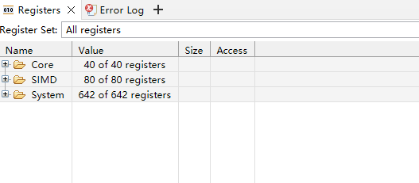
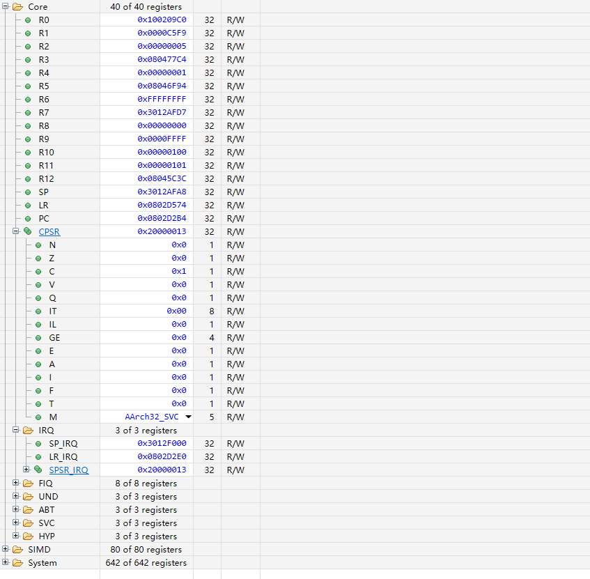
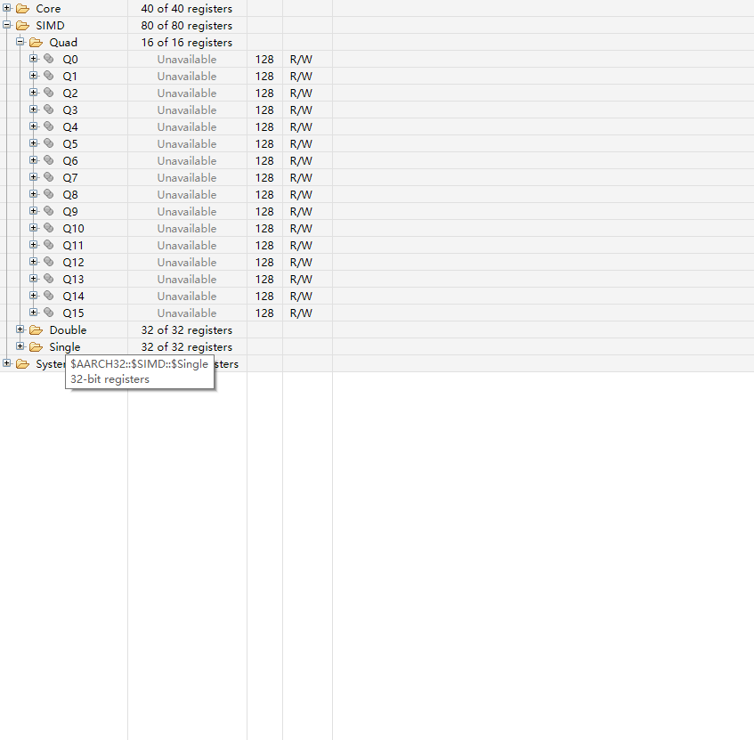
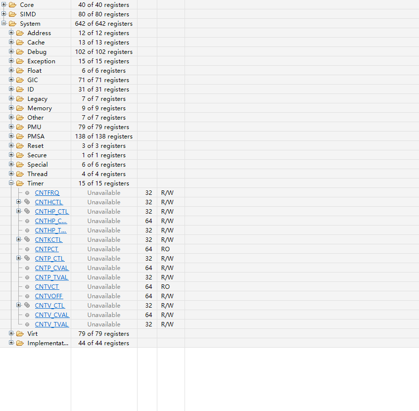
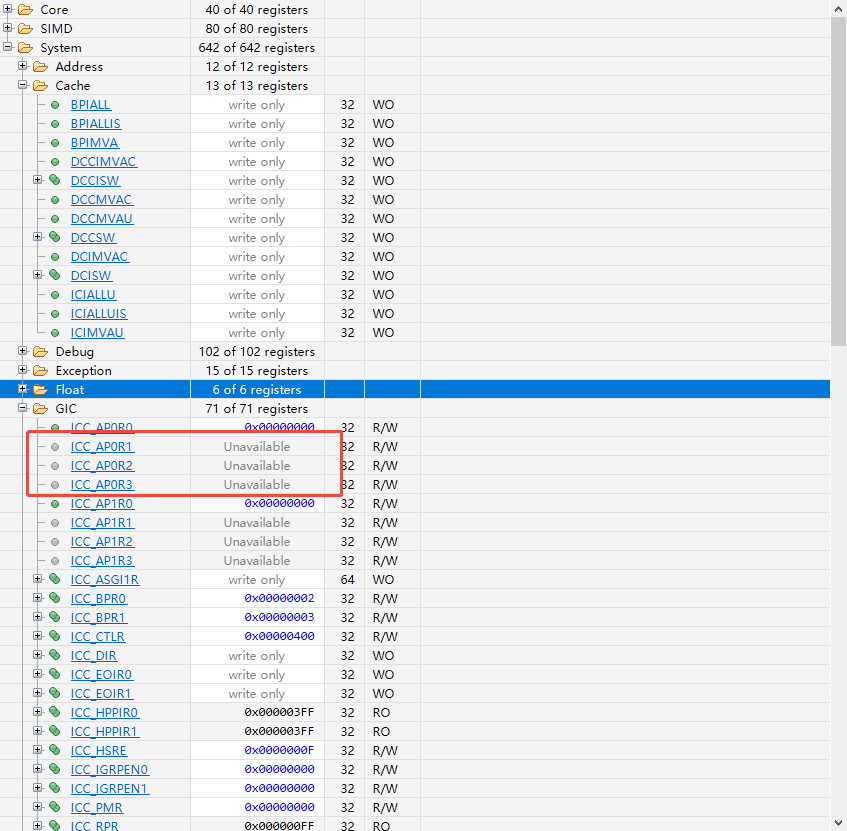

# DebugTUI 寄存器与调试访问开发 TODO 计划书

日期：2026-10-04。源码基线：0.9.3。适用读者：DebugTUI、OpenOCD 和板级配置开发人员。

本计划将现有通用寄存器列表扩展为具有 Arm Development Studio 分组、位域和状态展示能力的寄存器窗口，并纳入 GitHub 开放 Issues 中的总线访问 target 配置、展示以及变量/内存/寄存器写入需求。优先服务 THA6206 的 MCAL 与 Bao 调试，同时保持单核、多核以及 STM32 等既有目标的兼容性。寄存器读取按“确认读取能力 → 建立数据模型 → 改造界面 → 扩展读取 → 实板验收”推进；总线入口与写入能力分别跟踪，写入不作为前期只读版本的发布条件。

状态：开发中。2026-10-05 按逐项软件证据核对，71 项中已完成 13 项、未完成 58 项；勾选项的范围及证据见 [框架自检](register-framework-audit.md) 和开发进度。本计划不代表扩展寄存器已经在实板上读取成功。

## 当前版本与新功能版本计划

2026-10-04 核对结果：当前源码与本地安装均为 **v0.9.3**。`Cargo.toml`、`Cargo.lock` 和 `package.json` 的项目版本为 `0.9.3`，本机执行 `debugtui --version` 返回 `debugtui 0.9.3`。GitHub Latest 正式 Release 同为 [v0.9.3](https://github.com/bei-li16/DebugTUI/releases/tag/v0.9.3)，发布时间为 2026-10-03 20:14:53，时区 Asia/Shanghai。

以下为建议目标版本，均处于待开发状态，版本号不代表已实现或已发布，也不设未经评估的发布日期。版本计划只写入本文档；实际版本文件在相应功能和验收完成后更新。

| 版本 | 计划功能 | 对应 TODO | 关键发布条件 |
| --- | --- | --- | --- |
| v0.9.3 | 当前基线：已有 GDB 平面寄存器列表、内存通道和刷新机制 | 现状核对，不计为新任务完成 | 源码、本地安装和 GitHub 正式 Release 已核对一致 |
| v0.9.4 | 总线访问入口改进：Setup 通道编辑，Watch、Peripherals、Memory 的可见入口，实际 target、endpoint 与来源展示，保存及错误处理 | BUS-001 至 BUS-008；BUS-006 的新系统寄存器 MMIO 联调随 v0.11.1 完成 | BUS-T01 至 BUS-T05、BUS-H01 至 BUS-H03；既有面板路由验证；Issue #1 的本批范围有证据 |
| v0.10.0 | 寄存器基础框架：目录及 CPU 类型选择、树形分组、字段与枚举、Name/Value/Size/Access、注释、状态原因、实现条件过滤、按需读取、core/cluster/chip 归属模型；接入现有 GDB 可读寄存器 | REG-101 至 REG-110、REG-201 至 REG-211；REG-001 至 REG-008 为前置核对 | REG-T01 至 REG-T11；现有 Core 寄存器、目录选择、字段和逐核归属实板验收；未实现、不可访问、后端不支持分别解释 |
| v0.10.1 | THA6 基础系统寄存器：32 位 CP15、ID/控制/异常/线程信息、EL1/EL2 MPU、选择器事务及故障隔离 | REG-301、REG-302、REG-306、REG-307、REG-308 的本批范围 | REG-H01、REG-H04、REG-H06、REG-H08 至 REG-H11；core0/core1/双核和 Bao MPU 验证；错误恢复及并发事务通过 |
| v0.10.2 | 银行与浮点寄存器：各实际实现模式的银行寄存器、VFP/FPSCR、S/D 和目标可支持的 Q 视图、浮点与向量格式 | REG-303、REG-304、REG-305；补齐 REG-308 的银行和浮点故障场景 | REG-T03、REG-H02、REG-H03；使能及未使能状态均有证据；不改 CPU 模式、不隐式使能 FPU |
| v0.11.0 | Generic Timer 与 Bao：32/64 位 Timer、完整高低位、采样一致性、EL2 Timer/Virt/MPU 的适用范围；必要的后端能力补齐 | REG-401、REG-402、REG-403、REG-407 | REG-H05、REG-H07；64 位实板读取与高位验证通过；后端版本、CFG 和被测工具产物明确 |
| v0.11.1 | 扩展模块：PMU、GIC、Debug，以及芯片实际提供的 STM 只读配置和状态；GIC 能力识别和可选寄存器过滤；接入统一 MMIO 访问通道 | REG-404、REG-405、REG-406、REG-408；BUS-006 的新系统寄存器 MMIO 联调 | 实际存在模块逐类验收，归属和读副作用明确；GIC AP 寄存器数量与能力一致；MMIO 通道与选定 target 一致；不声明 Trace 采集和解码已支持 |
| v0.12.0 | 基础写入：统一编辑流程、可赋值 Watch/Locals、RAM、后端已支持的通用寄存器及语义明确的普通 RW 外设寄存器 | WRITE-001 至 WRITE-005、WRITE-008 至 WRITE-012 的基础范围；对应 Issue #3 | WRITE-T01 至 WRITE-T06、WRITE-T08 至 WRITE-T12，WRITE-H01、WRITE-H02、WRITE-H04 至 WRITE-H06；混合权限/特殊写语义未支持时阻止写入并解释 |
| v0.12.1 | 寄存器与位域写入扩展：字段权限、保留位、特殊写语义、已适配系统/银行/浮点寄存器 writer，以及 MMIO 与选择器事务 | WRITE-006、WRITE-007；补齐 WRITE-005 和 WRITE-008 至 WRITE-012 的扩展范围 | 全部 WRITE-T/H 中适用于交付类别的用例；不可回读、部分失败及结果未知状态准确；Issue #3 剩余范围逐项说明 |

版本顺序以当前基线后的交付建议为准。v0.9.4 可以先复用已有读取通道交付；v0.10.0 建立扩展寄存器框架；后续版本按实际读取能力增加类别。银行寄存器、64 位 Timer 等若需要修改 OpenOCD，应在对应版本发布前补齐工具构建和实板证据；有阻塞时调整该功能的目标版本，并在发布说明中保留明确缺口。

### 版本任务和 Issue 跟踪规则

- REG-001 至 REG-008 是 v0.10.0 的前置能力核对，后续版本按新增类别补充矩阵；已有状态或命令清单不能当作所有类别已读通。
- REG-501 至 REG-506 适用于每个计划版本，包括 v0.9.4，分别保留对应版本的回归、文档、构建、安装和交付证据。
- BUS-006 分两次验收：v0.9.4 完成既有 Watch、Peripherals、Memory 和可寻址 MMIO 路由；v0.11.1 完成新增系统寄存器 MMIO 的联调。该完整 TODO 在全部约定范围完成后勾选。
- Issue #1 以 v0.9.4 的跨面板通道入口与 target 配置验收为主要交付目标；若其原始需求仍有未满足项，继续保持待完成记录，不因计划版本已发布而自动认定 Issue 完成。
- Issue #2 按 v0.10.0 至 v0.11.1 分批跟踪。框架、不同读取通道、位域、归属和注释逐项记录，支持列表以实际发布的类别为准。
- Issue #3 按 v0.12.0、v0.12.1 分批跟踪，版本是本计划建议，不是 GitHub 已设置的里程碑。WRITE-005、WRITE-008 至 WRITE-012 分批验收，全部约定范围完成后才勾选；不能用 Console 可执行赋值代替界面编辑、字段权限和写后刷新验收。
- 版本范围发生变化时，同步更新本节、对应阶段及测试报告。发布前核对目标 tag 是否已经被其他工作使用，已占用则顺延；不复用已发布版本号。

### 每个版本的共同发布条件

对应任务和用例通过后，再更新 `Cargo.toml`、`Cargo.lock` 中的项目条目与 `package.json`，重新构建并打包。检查 EXE 的 `--version`、安装后版本、包内 profile 和工具依赖与报告一致；完成升级保留客户配置的验证。源码提交、tag 与 Release 附件分别检查，不能仅凭提交源码认定发布完成。

寄存器写入和位域修改已纳入 Issue #3 的建议版本；完整 Trace 采集和解码仍为未排期候选。写入实现可以复用已完成的数据模型并独立开发，不必等待所有只读寄存器类别全部接入；每个 writer 仍需单独证明权限和后端能力。

## 目标与范围

首批实现只读查看，包含寄存器分组树、字段展开、位宽和访问属性、进制与浮点格式、搜索、变化高亮、错误状态和逐核数据隔离。后续按后端实际能力接入银行寄存器、浮点、MPU、Timer、PMU、GIC 和 Debug 等类别。

关联范围包括 Watch、Peripherals、Memory 和其他 MMIO 读取的通道配置、可见入口与实际 target 信息。现有通道和刷新逻辑尽量复用，新增界面不另建一套与既有配置冲突的访问策略。

RW 表示架构描述中的访问属性，v0.9.4 至 v0.11.1 的前期界面仍只读。Issue #3 后续增加 Watch、Locals、Memory、System Regs 和 Peripherals 的编辑能力，具体对象按实际权限开放；自动使能 FPU、完整 STM 跟踪采集和解码不属于写入入口的默认行为。寄存器功能不依赖 ADS 或 VS Code，保留 PowerShell 中独立运行能力。

## GitHub 开放 Issues 与计划对应

核对时间：2026-10-04 12:03，时区 Asia/Shanghai。通过 GitHub API 查询全部 Issue、开放状态、正文和评论，当前有 3 个开放 Issue，三项评论数均为 0；没有已设置的负责人、标签或里程碑。相较此前记录，新增 #3；#1、#2 仍开放，本次未发现新的评论补充。以下优先级、版本和任务拆分均为本计划建议，后续更新需重新核对 GitHub 状态。[仓库 Issues](https://github.com/bei-li16/DebugTUI/issues)

| Issue | 原标题 | 核对状态 | 建议优先级 | 纳入方式 |
| --- | --- | --- | --- | --- |
| [#1](https://github.com/bei-li16/DebugTUI/issues/1) | watch/peripheral选择的target静默入口不可见 | Open，2026-10-04 创建 | P1 | 新增 BUS-001 至 BUS-008，覆盖变量、外设、内存和其他 MMIO 的访问入口 |
| [#2](https://github.com/bei-li16/DebugTUI/issues/2) | 系统寄存器显示缺失 | Open，2026-10-04 创建 | P0 为基础模型与界面，扩展读取按各阶段优先级 | 关联现有 REG 任务，补充目录选择、cluster 归属和说明展示 |
| [#3](https://github.com/bei-li16/DebugTUI/issues/3) | 支持调试界面修改变量或者寄存器 | Open，2026-10-04 11:40:53 创建及更新（Asia/Shanghai） | P1，建立独立写入能力及验收 | 新增 WRITE-001 至 WRITE-012，覆盖变量、内存、寄存器和字段权限；建议 v0.12.0/v0.12.1 分批 |

### Issue 1 总线访问入口

Issue 希望用户能配置总线访问所使用的 AP 对应 target，并用于不同类型的数据读取。[Issue 1](https://github.com/bei-li16/DebugTUI/issues/1)

源码已有 `memory_access` 通道及 Watch、Peripherals 的刷新策略弹窗；通道列表目前主要显示标签和运行能力。因此本计划先复现入口难发现及实际 target 信息缺失的场景，再完善入口、编辑和展示。该源码核对不能代替对用户现场问题的复现。

设计建议：Setup 提供可见的访问通道配置入口；各相关面板提供 Access 或等效按钮，显示当前通道与实际 target。用户选择后端已经定义的 target；DAP、AP 与 target 的硬件映射仍由工具环境或板级 CFG 提供。缺少 target 时明确提示需要配置的位置，不静默切到其他通道。

### Issue 2 系统寄存器需求覆盖

以下按 Issue 提出的七项需求建立任务对应，保留原 REG 编号，避免重复开发。[Issue 2](https://github.com/bei-li16/DebugTUI/issues/2)

| 需求 | 对应任务 | 补充或验收重点 |
| --- | --- | --- |
| 系统寄存器显示 | REG-101、REG-103、REG-201、REG-301 | 目录、状态、树及实际读取分开验收 |
| 协处理器和 MMIO | REG-302、REG-402、REG-405、BUS-006 | 不将 CP15 当成普通内存地址 |
| percore、percluster、perchip | REG-106、REG-109、REG-210 | 显式 owner 与 topology，共享值不冒充当前核私有值 |
| 字段、注释与枚举 | REG-105、REG-203、REG-209 | 覆盖 CPSR.M 为 19 时显示 AArch32_SVC |
| name、value、size、access | REG-202 | 宽屏及窄屏均能查看完整信息 |
| 手动加载或选择 CPU 类型 | REG-102、REG-108 | 支持目录文件选择及 cortex-m4、cortex-r52+ 等已适配类型 |
| 注释交互 | REG-209 | 选中说明区或帮助弹窗必备，鼠标悬停为可选增强 |

### Issue 3 变量、内存与寄存器修改

新需求要求直接在调试界面修改可写寄存器、Watch/Locals 变量和 Memory，并特别处理同一寄存器内各字段写权限不同的情况；同时补齐遗漏场景。[Issue 3](https://github.com/bei-li16/DebugTUI/issues/3)

v0.9.3 已有原始 GDB Console，可透传后端支持的赋值命令，但没有统一的面板编辑器、写入请求模型、字段写权限校验和结果确认流程；现有 SVD 展示模型主要服务读取，不能仅凭整寄存器的 RW 标签开放所有位。该问题按新增功能跟踪，现状不计为需求已完成。

| 需求 | 对应任务 | 验收重点 |
| --- | --- | --- |
| 通用、系统、外设等可写寄存器修改 | WRITE-001、WRITE-002、WRITE-005、WRITE-009 | 分别验证 GDB、系统寄存器专用接口与 MMIO writer；只读目录存在不代表可写 |
| 同一寄存器各位域写权限不同 | WRITE-006、WRITE-007 | 字段属性覆盖及继承、RO/WO/RW、保留位、一次写入和写副作用；不能统一套用整字读改写 |
| Watch/Locals 变量和 Memory 修改 | WRITE-003、WRITE-004 | 类型、可赋值性、地址、范围、字节序、栈帧和当前物理核；错误不隐式切换写通道 |
| 补充遗漏场景 | WRITE-008 至 WRITE-012 | 多核共享归属、运行限制、过期上下文、别名与缓存、超时/部分成功、键鼠操作、headless 一致性与实板回归 |

这些扩展和交付拆分是本计划对 Issue 的实现建议，不代表 Issue 作者已逐项确认，也不代表代码已实现。前期只读版本保持原边界；新增写入单独验收。

Issue 关闭条件以其需求和测试证据为准；计划中的勾选状态与 GitHub Open 或 Closed 状态分别记录。本文档更新不修改 GitHub Issue 状态。

## 现状和已核实的依据

| 项目 | 当前事实 | 对开发的影响 |
| --- | --- | --- |
| THA6 模板 | `gdb.registers` 配置 r0–r12、sp、lr、pc、cpsr 共 17 项 | 这是自动读取名单，不能代替 CPU 寄存器目录 |
| GDB 读取 | 使用 `-data-list-register-names` 和 `-data-list-register-values`；空名单读取 GDB 报告的非空名称 | 空名单不能使调试服务器获得原本没有的读取能力 |
| 数据与界面 | `Snapshot.registers` 为平面变量列表；右侧 System Regs 使用该列表 | 需要引入分组、描述元数据和逐项状态 |
| 数值格式 | 已有基于 `u128` 的整数格式化 | 可复用基本格式化；浮点、向量和别名仍需实现 |
| SVD | 已有 MMIO 地址、字段、访问属性和读副作用描述 | 可借鉴外设面板机制；CP15 访问需要独立描述 |
| 内存通道 | 支持显式 OpenOCD target；64 位内存值使用两次 32 位读取 | 此能力不能直接当成 64 位 CP15 读取，也不保证采样原子性 |
| 修改入口 | 原始 GDB Console 可透传命令；当前面板没有统一的变量/内存/寄存器编辑流程 | 新增 writer、字段权限和结果状态，不能把现有 reader 直接当作 writer |
| 多核 | 每核 GDB 会话、快照和 generation 已存在 | 在此基础上实现扩展寄存器归属和过期响应丢弃 |
| 本地 OpenOCD | 离线帮助中有 `aarch64 mrc/mcr`、`get_reg/set_reg`，未找到公开的 `mrrc/mcrr` 命令 | 64 位系统寄存器通道待验证；不能据此断言驱动内部完全不支持 |
| 配置解析 | 多处使用 `deny_unknown_fields` | 新配置字段必须先扩展解析、校验和兼容测试 |

OpenOCD 离线核对版本为 `0.12.0+dev-g50fdce2`，构建日期为 2026-01-18。上述后端核对没有连接实板。项目实际 CPU 型号、可选扩展、寄存器数量和权限仍需在阶段零确认。

### ADS 参考界面的含义

用户截图展示 Core 40 项、SIMD 80 项和 System 642 项。其中 SIMD 和 Timer 的多个值为 `Unavailable`，因此目录条目数量不能作为成功读取数量。DebugTUI 不硬编码这些数量，也不将不可访问的值显示为零。

Core 展示当前模式寄存器、CPSR 字段，以及 IRQ、FIQ、UND、ABT、SVC、HYP 等模式银行寄存器。SIMD 展示 Quad、Double、Single 三类视图；Q、D、S 的重叠关系必须按实际架构和目标特性处理。GDB 在相应 VFP、NEON 等特性存在时可生成部分 S、Q 视图，截图中的目录本身不能证明目标支持 NEON。[GDB ARM Features](https://sourceware.org/gdb/current/onlinedocs/gdb.html/ARM-Features.html)

System 包含 PMSA、PMU、GIC、Timer、Virt 等类别。截图的 Timer 是 Generic Timer，与 CoreSight STM 分别适配。Cortex-R52 的部分 64 位系统寄存器使用 MRRC/MCRR 访问；具体编码以实际 CPU 手册为准。[Arm Cortex-R52 技术手册](https://documentation-service.arm.com/static/66548bea4072745e25d843bc)

本机 ADS 的寄存器 XML 可用于理解分组和别名呈现；交付的寄存器目录依据公开架构文档独立维护，不依赖 ADS 安装目录或分发其配置文件。

### ADS 原始截图与开发参考

以下五张图由用户提供，原图保存在本文档旁的 `images/registers/`，通过相对路径引用，供后续设计、实现和验收对照。截图中的数量、数值和访问状态仅表示参考界面的显示内容，实际支持范围以阶段零能力矩阵及实板验收为准。

#### 图一 寄存器分类与表格布局

开发参考：保留 Core、SIMD、System 分类树、Register Set 筛选入口，以及 Name、Value、Size、Access 信息。明确区分目录条目数量和成功读取数量。对应 REG-201、REG-202、REG-204、REG-205。

#### 图二 Core 寄存器和 CPSR 位域

开发参考：CPSR 可展开 N、Z、C、V 等字段，并将 M 解码为模式名称；IRQ、FIQ、UND、ABT、SVC、HYP 分别展示银行寄存器。字段值与父寄存器使用同一采样，读取银行寄存器不改变 CPU 模式。对应 REG-105、REG-203、REG-303、REG-T02、REG-H02。

#### 图三 SIMD 多位宽视图与不可访问状态

开发参考：支持 Quad、Double、Single 分组及位宽信息，按目标能力处理 Q、D、S 的重叠视图；不可访问显示明确状态并保留原因。图中目录存在不能作为目标支持或读取成功的证据。对应 REG-103、REG-105、REG-205、REG-304、REG-305、REG-T03、REG-H03。

#### 图四 System 分类与 Generic Timer

开发参考：支持 System 下的多层分类、32 位和 64 位混合显示、访问属性及逐项状态；Generic Timer 与 STM 分别适配。优先验证 Bao 所需 Timer、Virt、EL2 MPU，具体目录依据实际实现生成。对应 REG-301、REG-306、REG-401 至 REG-407、REG-H04、REG-H05、REG-H07。

#### 图五 GIC 可选寄存器与只写项目

开发参考：区分“目录有定义”“当前硬件有实现”“本次读取成功”。Cache 维护操作及 GIC 的 WO 项目显示 write only，不能作为读失败处理；AP 寄存器数量按实际实现能力确定。对应 REG-008、REG-110、REG-211、REG-408、REG-T11、REG-H14。

## ADS Unavailable 的原因与判定

### 截图中的 GIC AP 寄存器

在目标确为 Cortex-R52 或 Cortex-R52+ 的前提下，圈出的 `ICC_AP0R1`、`ICC_AP0R2`、`ICC_AP0R3` 符合“该实现没有这些扩展 AP 寄存器”的情况；旁边的 `ICC_AP1R1～3` 同样需要按实现能力判断。该结论不能推广到所有显示 Unavailable 的项目。

Arm 的 R52 与 R52+ 技术手册在相应 CPU 接口中列出 `ICC_AP0R0`、`ICC_AP1R0`；R52 的 GIC 优先级能力为 5 位。AP 编号扩展取决于实现的优先级或抢占优先级能力：R1 需要至少 6 位，R2 与 R3 需要 7 位。判定使用具体架构版本与目标手册，不依据名称是否存在于通用目录。[Cortex-R52 技术手册](https://documentation-service.arm.com/static/66548bea4072745e25d843bc)、[Cortex-R52+ 技术手册](https://documentation-service.arm.com/static/66548bde4072745e25d841c5)

截图还显示 `ICC_AP0R0` 和 `ICC_AP1R0` 有有效值，`ICC_CTLR = 0x00000400`。其 `PRIbits[10:8] = 4`，该字段编码为实现的优先级位数减一，即当前展示接口为 5 位优先级。此结果与扩展 R1～3 不存在的解释一致。它是截图值与架构规则的推断，本次没有重新读取板卡或核对该 ADS 会话的实际目标选择与访问路径。

实现时还要区分物理 ICC 与虚拟化重定向后的 ICV 视图，不能把当前 EL1 的读值自动当作物理硬件全部能力。读取 `ICC_CTLR.PRIbits`、适用时的 `ICH_VTR` 等能力信息应记录 EL、访问通道与实际视图；`PRIbits`、`PREbits` 的含义及适用接口分别处理。当前 Binary Point 设置不改变已实现的 AP 寄存器数量。

### ADS 目录为何仍显示这些条目

本机 ADS 2022.1 的 `Cortex-R52.xml` 和 `Cortex-R52+.xml` 均引用 `V8R_AARCH32_ArchitecturalSystemRegisters.inc`，后者加载 `Registers/System/ARMv8.0-R/` 中的通用分类。该目录的 `V8_AARCH32_GIC.xml` 同时定义 AP0R0～3 和 AP1R0～3；R52+ 的核心定义还对 PMSA、Virt 等类别加入专用覆盖。

因此，更准确的解释是：ADS 复用 ARMv8-R/AArch32 的较宽寄存器描述，再叠加具体核心定义。这个展示目录包含可选实现项目，并不等于当前芯片的硬件清单，也不能说它不区分架构、把所有 AArch32 寄存器无条件搬入。配置文件核对能证明目录来源；具体 Unavailable 是后端预先判定还是实际读失败后的结果，需要会话日志或后端诊断才能确定。

本机核对根目录为 `C:\Program Files\ARM\Development Studio 2022.1\sw\debugger\configdb\`。其 `Docs/SysReg_v80R_xml-00alp3_rc3/xhtml/` 下 AP0Rn、AP1Rn 与 ICC_CTLR 说明包含条件及字段定义。这些安装资源仅作为核对依据，不纳入 DebugTUI 的运行依赖或发行包。

### 不可用原因分类

| 类别 | 判断依据 | DebugTUI 展示和读取策略 |
| --- | --- | --- |
| 硬件未实现 | CPU 修订版、可选扩展及数量能力明确排除此项 | 显示 Not implemented 及依据；默认过滤，可在全部架构定义视图查看；不自动试读 |
| 当前访问受限 | 目标已实现，但模式、EL、虚拟化、使能状态或调试授权限制访问 | 显示 Unavailable 和已知条件，不自动修改权限或使能位 |
| 后端读取不支持 | 硬件支持，但 GDB、OpenOCD 或探针没有对应读通道 | 显示 Reader unsupported，明确是工具能力缺口 |
| 传输或目标故障 | 超时、断开、目标异常或读命令失败 | 显示 Error，保留原始错误并退避；不据此判硬件不存在 |
| 原因未确定 | 只有 Unavailable 或泛化错误，没有充分证据 | 保留 Unavailable，原因写为 Unknown；列入后续能力核对 |
| 架构只写操作 | 元数据明确为 WO，例如图中的 Cache 维护操作 | 显示 Write only；不发读取，不作为读取失败计数 |

上表是开发设计。硬件实现、当前访问条件和 reader 能力作为独立维度记录，最终采样状态沿用下文模型并附带原因。禁止仅凭 Undefined、Unavailable 或零值判定硬件不存在：Undefined 也可能由访问条件产生，零值也可能是合法值或架构定义的 RAZ 行为。

默认视图显示目标已实现及实现状态未确定的项目，明确未实现项目在“全部架构定义”筛选下可查看。能力寄存器无法读出时保留未知状态，避免错误隐藏。优先用身份及无副作用能力信息作条件判断，禁止遍历尝试所有未知 CP15 编码；否则可能把显示功能变成持续的调试错误来源。

## 设计约定

### 配置与寄存器目录

保留项目 `debug.toml`、工具环境 `debug-env.toml` 和用户 `profiles/devices.toml` 的现有职责。芯片目录继续声明芯片、核心与 backend；增加可选的 CPU 寄存器目录关联，具体字段名在阶段一确定。backend 负责工具环境匹配，寄存器目录描述 CPU 架构与展示信息。

建议目录格式沿用 TOML。内置目录随发行包提供，允许用户目录扩展和项目显式指定目录。拟采用“项目指定 → 用户芯片关联 → 内置匹配 → 原有 GDB 列表”的选择顺序；缺少显式指定的目录时报告配置错误，未配置新功能的旧项目正常回退。

Setup 增加寄存器目录选择，支持手工选择文件或从已适配 CPU 类型中选择。CPU 类型选择不改变 Chip、Debug cores、backend、下载算法或板级启动脚本；选择与实际目标不匹配时给出提示。目录预览显示名称、架构、来源和支持条件，用户选择的引用在 Save config 时保存。

这些规则属于待实现设计，当前版本不能直接添加尚未定义的新字段。工程只保存目录引用和展示偏好，不复制数百项寄存器定义。路径相对声明它的文件解析，并测试 `/`、`\`、空格、中文和 UNC；内置、用户及项目来源必须在日志中可辨认。

寄存器元数据至少包含以下内容：

| 内容 | 用途 |
| --- | --- |
| 稳定 ID、名称、分组路径、说明 | 定位条目、构造树、保存展示偏好 |
| 位宽和 RO、RW、WO 属性 | 数值格式与读取校验；WO 不自动读取 |
| reader 类型及访问参数 | GDB 名称、CP15 编码、MMIO 地址或别名来源 |
| CPU、修订版、可选扩展及数量条件 | 区分架构有定义、目标有实现和当前可访问，保存判断依据 |
| 模式或 EL 条件、core、cluster 或 chip 归属 | 解释访问限制，避免私有值和共享值混用 |
| 字段位段和枚举 | 展开 CPSR、权限与控制寄存器 |
| 别名、浮点和向量布局 | 一份原始值生成相关视图 |
| 读副作用与自动读取策略 | 决定按需读取或仅手工读取 |

CPSR 的 IT 等非连续字段需要多个位段；不能只用连续 offset 和 width 表达。32、64、128 位原始值使用明确位宽的字节序列或十六进制字符串传递，避免 JSON 数字精度损失。

### 读取通道与状态

统一接口接收寄存器 ID、物理核心、会话标识和停止代次，由后端选择读取方式。界面不直接拼接 GDB 或 TCL 命令。

| 读取方式 | 适用范围 | 必要限制 |
| --- | --- | --- |
| GDB MI | 目标描述已经暴露的 Core、银行或浮点寄存器 | 验证名称和位宽，保留原始寄存器编号 |
| OpenOCD 系统寄存器访问 | 已验证的 CP15 寄存器 | 区分 32 位与 64 位编码，检查目标状态和权限 |
| GDB 内存或 MEM AP | 有明确地址的 GIC、Debug、STM 等寄存器 | 地址、AP、访问宽度和权限来自板级配置 |
| 别名派生 | 字段、S/D/Q 等相关视图 | 从同一原始采样派生，明确目标架构和字节序 |

一个条目的状态应包含 `Not read`、`Valid`、`Unavailable`、`Unsupported`、`Error`、`Stale`。界面允许保留最后有效值，但必须附带采样时间和旧值标记。仅在后端提供足够依据时区分“没有实现”与“当前不可访问”；无法判断原因时保留原始错误和未确定原因，不猜测硬件能力。

实现状态另行记录 Yes、No、Unknown；原因使用 Hardware not implemented、Reader unsupported、Access restricted、Feature disabled、Transport error 或 Unknown 等明确分类，并保留来源。WO 由访问属性呈现为 Write only。不能把硬件缺失、后端缺口和权限错误全部压成同一个 Unsupported。

### 刷新和多核

默认读取暂停目标；运行中保留最后暂停值并标为旧值，不因打开分组隐式暂停或恢复核心。仅刷新可见且展开的分组，支持手工刷新单项或当前分组，失败退避且每条目限制在途请求。

缓存键包含芯片、连接会话、物理核心、寄存器 ID 和停止代次；需区分 CPU 当前状态与用户选中的栈帧。Core 通用寄存器沿用并明确现有栈帧语义，CP15 等系统寄存器标明读取的是物理核心当前状态。切核、复位、重连和更换 ELF 后丢弃过期结果。

扩展缓存的归属标识为 `core:<id>`、`cluster:<id>` 或 `chip:<id>`。cluster 对应关系由明确的目标拓扑提供，不能从核心编号猜测；没有拓扑时，不把共享寄存器自动归入某一 cluster。共享项目可复用采样，但必须绑定实际 owner、读取通道和有效代次；UI 显示 Scope 与 Owner，切核后共享值仍标明共享归属。

优先使用已验证的目标限定命令。需要全局 target 切换或选择器修改的操作，采用服务级事务调度，覆盖同一 OpenOCD 服务的多核读取、Live Watch、控制命令及 Console 路由；独立 TCP 连接不能代替这种调度。外部客户端不受内部调度控制，验收时需结束占用同一调试服务的其他客户端。

MPU 优先验证直接 PRBARn、PRLARn 访问；必须使用 PRSELR、HPRSELR 等选择器时，将“保存 → 选择 → 读取 → 恢复”作为一个事务，恢复失败使该通道停止继续轮询并报告状态。[Arm MPU register access](https://support.arm.com/documentation/100026/0100/memory-protection-unit/mpu-register-access)

### 写入权限与执行约定（Issue #3，待实现）

写入使用独立的能力模型，分别记录“元数据允许写、当前访问条件满足、后端 writer 支持”。可读或在目录中显示 RW，不代表当前模式/EL、探针和通道能够写入；某通道的 `while_running` 读取能力也不授予运行时写权限。默认只允许已暂停且上下文有效的目标，运行时写入另行评估，不隐式 Pause / Resume。

编辑器显示实际对象、物理核或共享 owner、栈帧/地址、位宽、通道和新值。确认前重新校验会话及停止代次；切核、切帧、Continue、Reset、Reconnect 或替换 ELF 后，旧草稿不能提交到新上下文。Scope All 不会把一次值修改广播到所有核；共享对象的影响范围明确展示，必要时要求用户先显式暂停相关核心。暂停 CPU 不等于停止 DMA、外设或其他总线主设备。

| 对象或语义 | 写入规则 |
| --- | --- |
| 普通可赋值变量 | 先核对类型、作用域和后端 editable 状态；可展开成员按独立可赋值对象处理。常量、优化掉/越界作用域值、不可赋值表达式给出原因；预览不调用目标函数或执行带副作用表达式。 |
| 普通 RAM | 校验地址区间、长度、访问宽度、对齐、字节序及通道。按有限长度写入；Flash 仍走已配置的 Download，不能当作普通 RAM 编辑。 |
| 普通 RW 位域 | 根据已解析的字段覆盖/继承与保留位规则生成写计划；只有整次访问可安全读取且无冲突副作用时才允许读改写，不直接使用旧显示缓存。 |
| 混合 RO/WO/RW、W1C/W0C、置位/翻转及一次写语义 | 使用对应操作和有效写掩码；无关特殊位写入规定的“不动作”值，不把刚读出的值原样回写。保留位按硬件规定保持或写固定值，不能统一清零。未知规则阻止字段编辑并说明原因。 |
| WO 或读取有副作用 | 不为预览、读改写或验证自动读取；已验证的专用写操作可提交，但结果标明“后端已受理/未回读验证”，不能显示为已验证的新寄存器值。 |
| CPU 状态、系统寄存器、选择器和别名 | 使用经过验证的 writer，明确 PC/SP/CPSR、MPU、Timer 等写入的影响。系统寄存器不冒充 MMIO；Q/D/S 等重叠视图只写一次实际存储并使所有别名失效。 |

寄存器和字段的 `access`、`modifiedWriteValues`、`writeConstraint`、`readAction` 应保留并按 CMSIS-SVD 的继承/覆盖规则处理；额外的保留位、授权或解锁条件需来自目标手册及目录描述。SVD 缺省不能单独作为未知地址可写的依据。[CMSIS-SVD 寄存器与字段定义](https://arm-software.github.io/CMSIS_5/SVD/html/elem_registers.html)

普通变量可评估复用 `-var-show-attributes` / `-var-assign`；内存可评估 GDB `-data-write-memory-bytes` 或已验证的 target 限定写接口。通用寄存器赋值和 CP15/银行寄存器专用写接口需独立能力核对，不承诺所有 GDB/OpenOCD 都可写。[GDB/MI Variable Objects](https://sourceware.org/gdb/current/onlinedocs/gdb.html/GDB_002fMI-Variable-Objects.html)、[GDB/MI Data Manipulation](https://sourceware.org/gdb/current/onlinedocs/gdb.html/GDB_002fMI-Data-Manipulation.html)

写后更新相关 Watch、Locals、寄存器、字段和 Memory 缓存；可安全回读时按有效位掩码或架构效果验证。W1C 等命令值不等于期望回读值，计数器或自清零位也不能要求逐位相等。超时/断连可能发生在实际写入之后，结果应标为未知，不自动重试、回滚或重放；多次传输中途失败按已知结果记录，不能宣称整批具有原子性。服务级事务只能防止 DebugTUI 自身命令交错，不能保证硬件寄存器或多主设备访问原子性。

## 开发阶段与 TODO

### 阶段零 确认硬件和后端能力

优先级 P0。目标：v0.10.0 前置核对，后续版本按新增类别补充能力矩阵。后续寄存器适配以此结果为依据，目录和 UI 可以使用隔离夹具提前开发。

- [ ] REG-001：记录实际 DebugTUI、GDB、OpenOCD 路径、版本和哈希，确认 THA6206 实际 CPU、修订版及可选扩展；THA6104、THA6412 的关联另行核对。
- [ ] REG-002：获取 GDB 名称列表和可用目标描述，记录 Core、银行、VFP 名称、位宽和读取结果，明确列表可见与实际可读的区别。
- [ ] REG-003：验证目标限定的 `mrc`、`get_reg` 等命令；分别检查 core0、core1，保留原始响应与 OpenOCD 日志。
- [ ] REG-004：确认 64 位系统寄存器是否可经 GDB、`get_reg` 或其他已支持接口读取；记录缺口，不用两次任意 MRC 冒充 MRRC。
- [ ] REG-005：核对 EL1、EL2、MPU 区域数量、FPU 启用状态和 Generic Timer 能力；不可访问不自动判为未实现。
- [ ] REG-006：确认 OpenOCD 源码及构建方法是否可获得。需要增加驱动能力时建立独立修改清单、构建产物和版本依赖。
- [ ] REG-007：形成“寄存器类别、读通道、位宽、状态条件、目标核心、支持状态、证据”的能力矩阵。
- [ ] REG-008：核对 ADS 通用目录与 R52/R52+ 实现差异，采集目标身份及适用的 GIC 能力信息，逐项解释图五 AP 寄存器和其他 Unavailable；明确物理与虚拟视图及原始错误，作为 v0.10.0 前置核对。

完成条件：每个计划类别都有已验证读取通道，或明确列为待补后端、当前不可访问、未确定。未经实板验证的类别不标为支持。

### 阶段一 建立目录和统一数据模型

优先级 P0。目标版本：v0.10.0。依赖 REG-007 的能力边界。

- [x] REG-101：实现目录解析和校验：版本、重复 ID、组引用、位宽、字段越界、别名循环、缺少读取参数和文件大小限制。
- [ ] REG-102：扩展配置与芯片关联，测试旧配置回退、未知字段报错、路径来源和目录选择优先级。
- [x] REG-103：实现寄存器描述、原始值、逐项状态、采样时间和读取错误结构，保留已有 `Snapshot.registers` 的兼容输出。
- [x] REG-104：建立 GDB reader，支持请求指定项目、隔离失败，避免单个扩展寄存器不可读导致整个 Core 组无结果。
- [x] REG-105：实现连续和非连续位域、枚举及别名派生；补齐 64、128 位边界和字节序处理。
- [ ] REG-106：实现逐核缓存、会话和 generation 校验；复位、重连、切核、更换 ELF 和切栈帧按设计使相应结果失效。
- [ ] REG-107：打包内置目录并初始化用户扩展位置；升级保留客户目录，验证 npm、EXE、ZIP 与 `--init-profiles` 路径。
- [ ] REG-108：实现 Setup 的寄存器目录浏览与已适配 CPU 类型选择；覆盖 cortex-m4、cortex-r52+ 的目录关联、取消、保存、来源显示及目标不匹配提示，对应 Issue #2。
- [ ] REG-109：实现 percore、percluster、perchip 的元数据、显式拓扑与 owner 缓存规则；未知归属显示未确定，补齐跨 cluster 和共享结果的隔离测试，对应 Issue #2。
- [ ] REG-110：实现可选寄存器及数量条件、Yes/No/Unknown 实现状态与读取原因分类，保存判定依据；无法取得能力信息时保留 Unknown，WO 不安排读取，目标版本 v0.10.0。

完成条件：旧工程正常运行；新模型能用现有 17 项 Core 寄存器和模拟失败结果完整驱动界面。新配置语法确认后再写入公开示例。

### 阶段二 改造寄存器窗口

优先级 P0。目标版本：v0.10.0。依赖阶段一。

- [x] REG-201：保留现有 System Regs 入口，内部展示 Core、SIMD、System 等分组树；支持键盘和鼠标展开、选择与滚动。
- [x] REG-202：增加 Name、Value、Size、Access 列；小窗口优先保留名称与值，详细信息在选中条目的说明区呈现。
- [x] REG-203：支持 CPSR 等字段展开和模式枚举；父值与字段使用同一份采样。
- [x] REG-204：增加名称和说明搜索，以及 All、Core、SIMD、System 分组筛选；筛选不触发整目录读取。
- [x] REG-205：展示逐项状态、最近有效值、错误详情和可读数；目录总数、当前显示数和本次有效值数量分别计数。
- [x] REG-206：实现按需读取、手工 Refresh、在途限制、错误退避和取消；折叠组不继续自动读扩展项。
- [x] REG-207：沿用寄存器进制偏好和逐核变化高亮；保存展开、筛选和格式偏好，避免复用其他芯片同名条目的偏好。
- [ ] REG-208：完成 PowerShell 与 VS Code 终端的宽屏、小窗口、中文说明和高对比度视觉检查。
- [x] REG-209：实现寄存器及字段的说明区或帮助弹窗，展示描述、枚举符号、访问条件和读取状态原因；键盘可访问，鼠标悬停作为可选增强，对应 Issue #2。
- [ ] REG-210：展示当前目录、CPU 类型及条目的 Scope、Owner 和实际读取来源；切核后不将 cluster 或 chip 共享结果伪装为当前核私有结果，对应 Issue #2。
- [x] REG-211：增加目标实现视图与全部架构定义筛选，分别展示 Not implemented、Unavailable、Reader unsupported、Error 和 Write only；提供原因说明及分类计数，不对明确未实现项目自动试读，目标版本 v0.10.0。

2026-10-05：REG-101/103/104/105、REG-201/202/203/204/207/209 的逐项软件验收见 [框架自检](register-framework-audit.md)；REG-205/206/211 见 [状态与取消](register-read-status-and-cancel.md)。已完成／未完成为 **13/58**。REG-208 的实际终端视觉验收仍未执行；硬件用例已按用户要求保留延后执行。勾选不表示其余目标类别、完整阶段或全部 TODO 已完成。

完成条件：能展示 ADS 参考中的树、字段、位宽与状态；不要求具有相同目录数量。无扩展目录时现有平面列表行为仍可用。

### 阶段三 接入 THA6 银行寄存器和基础系统寄存器

优先级 P1。目标：v0.10.1 交付 REG-301、REG-302、REG-306、REG-307 及 REG-308 的基础系统寄存器故障处理；v0.10.2 交付 REG-303 至 REG-305 并补齐 REG-308 的银行和浮点故障处理。依赖阶段零、阶段一和阶段二；可以按类别独立交付。

- [ ] REG-301：建立经实际 CPU 手册核对的 THA6 目录，首先接入 ID、SCTLR、异常与故障信息、线程相关寄存器，逐项记录访问编码。
- [ ] REG-302：实现 32 位 CP15 reader 和目标状态校验；调试指令读取若使用临时通用寄存器，由后端完整保存和恢复其状态。
- [ ] REG-303：接入 IRQ、FIQ、UND、ABT、SVC、HYP 等实际实现的银行寄存器；优先使用 GDB 或后端专用访问，不通过改变 CPSR 模式读取。
- [ ] REG-304：接入 VFP 数据与 FPSCR 等控制寄存器，支持原始十六进制和浮点格式；覆盖未使能时的失败处理，不自动修改 CPACR、FPEXC。
- [ ] REG-305：实现 S、D 和可支持的 Q 视图；仅按目标能力建立对应关系，覆盖 NaN、无穷、负零及向量分量显示。
- [ ] REG-306：接入 EL1、EL2 MPU，依据实际区域数量构造目录，解析基址、限址、使能及权限；优先使用直接区域访问。
- [ ] REG-307：补齐必须使用选择器时的服务级事务和失败恢复，验证与多核、Live Watch、Console、Continue、Reset 的调度关系。
- [ ] REG-308：复现并分析此前讨论的可选寄存器读取故障；读取失败不持续刷错误、不拖垮通用寄存器和后续调试控制。

完成条件：每个已发布类别在 THA6206 core0、core1 和双核下有真实读取证据；不支持类别正确显示状态，核心状态在读取前后保持一致。

### 阶段四 接入 Timer 和其他扩展模块

优先级 P1 为 Generic Timer，P2 为 PMU、GIC、Debug 和 STM。目标：v0.11.0 交付 REG-401 至 REG-403 和 REG-407；v0.11.1 交付 REG-404 至 REG-406 和 REG-408。Bao 的 Timer 需求优先于扩展目录数量。

- [ ] REG-401：核对 CNTP、CNTV、CNTHP 等实际 Timer 寄存器及权限，接入已支持的 32 位项目。
- [ ] REG-402：为 CNTPCT、CNTVCT、CNTVOFF 和相关 CVAL 等 64 位项目实现正确读取；现有后端缺少通道时，补充 OpenOCD 并维护最低版本约束。
- [ ] REG-403：验证 64 位结果的高位、低位和采样一致性；仅在架构明确提供分段读取协议时使用该协议，并注明一致性边界。
- [ ] REG-404：接入 PMU，确认实际计数器数量、位宽和选址方式；查看不自动开始或清空计数。
- [ ] REG-405：接入 GIC、Debug 等适用寄存器，明确 MMIO、CP15 与每核或共享归属；有读副作用的项目仅手工读取并标明。
- [ ] REG-406：芯片确有 STM 时接入其适合只读的配置和状态寄存器，区分配置空间与 stimulus 空间；本阶段不实现 Trace 数据流采集与解码。[Arm STM 编程说明](https://developer.arm.com/community/arm-community-blogs/b/tools-software-ides-blog/posts/programming-arm-s-system-trace-macrocell)
- [ ] REG-407：完成 Bao EL2 下的 Timer、Virt 和 MPU 验证，检查切核及 Guest 运行时的数据归属和状态解释。
- [ ] REG-408：落实 GIC AP 可选寄存器的条件过滤与错误解释，按实际实现和接口区分物理 ICC、虚拟 ICV 及 ICH 能力；验证 5/6/7 位条件夹具和 R52 实板 AP0R0/AP1R0，禁止试读已确认未实现项，目标版本 v0.11.1。

完成条件：每个新增模块独立记录支持条件。64 位 Timer 未通过实板验证时不得声明已支持；其缺口不阻塞已完成基础功能的独立发布。

### 阶段五 回归和交付

优先级 P0，随 v0.9.4、v0.10.0、v0.10.1、v0.10.2、v0.11.0、v0.11.1、v0.12.0、v0.12.1 每批功能交付分别执行。

- [ ] REG-501：运行目录、解析、数值、错误恢复、调度和多核隔离测试，并接入已有功能验收入口及覆盖矩阵。
- [ ] REG-502：完成下方实板矩阵，对未执行项明确记录原因，禁止将跳过或目录存在计为通过。
- [ ] REG-503：更新用户手册的寄存器使用、配置方法和支持范围；更新架构文档的 reader、缓存和事务设计。
- [ ] REG-504：更新环境模板及 mcal-vsconfig 的配套说明；后端有变化时明确列出 OpenOCD、CFG 和目录文件依赖。
- [ ] REG-505：按实际交付范围升版、构建、安装并检查 EXE 版本和哈希；验证安装及升级不覆盖客户目录和原工程配置。
- [ ] REG-506：提交测试报告、支持矩阵和已知限制；确认交付包中的 profile 与被测二进制一致。

### 关联任务 总线访问通道配置与入口

优先级 P1，目标版本 v0.9.4，对应 Issue #1；BUS-006 的新增系统寄存器 MMIO 联调随 v0.11.1 完成。复用现有 `memory_access`、`ui.refresh`、monitor 及内存读取模块；基础入口可独立交付，供系统寄存器 MMIO reader 复用。

- [ ] BUS-001：复现 Watch、Peripherals、Memory 和其他 MMIO 的入口及 target 信息展示问题，记录当前入口位置、适用项和配置来源。
- [ ] BUS-002：增加 Setup 的访问通道列表与编辑入口，支持通道 ID、名称、TCL endpoint、target、适用核心和运行能力；校验及保存路径明确，取消不写入，项目覆盖不意外修改共享 profile。
- [ ] BUS-003：在 Watch、Peripherals、Memory 增加可见的访问入口，支持选择通道、手工读和适用时的刷新策略；键盘和鼠标均可发现并使用。
- [ ] BUS-004：展示实际通道、target、endpoint、配置来源和目标状态；AP 关联仅显示明确配置或后端可确认的信息，缺失时不猜测。
- [ ] BUS-005：保存每项或面板的访问选择，定义默认与覆盖顺序；旧刷新配置兼容，切核、重连、改 target 后清除相应绑定和旧采样。
- [ ] BUS-006：统一可寻址 Watch 标量、外设、Memory 与系统寄存器 MMIO 的读取路由；Watch 需要先由 GDB 解析地址和类型，寄存器变量及无地址表达式明确说明不能走 AP，不将任意表达式直接当成内存地址。
- [ ] BUS-007：覆盖错误 target、通道不可用、权限、运行能力与读副作用；失败不静默回退到 GDB 或其他 AP，不隐式 halt 或 resume。
- [ ] BUS-008：完成 BUS-T01 至 BUS-T05、BUS-H01 至 BUS-H03，更新通道配置示例、用户手册和功能覆盖矩阵，提供 Issue #1 的验收证据。

完成条件：用户可在 TUI 配置和选择可用入口，并能看到每次读取的实际 target；各面板策略一致，原有通道和调试执行行为保持兼容。

### 关联任务 调试界面写入变量、内存和寄存器

优先级 P1，对应 Issue #3。v0.12.0 交付 WRITE-001 至 WRITE-005、WRITE-008 至 WRITE-012 的基础范围；v0.12.1 交付 WRITE-006、WRITE-007，并补齐系统/银行/浮点等 writer 和其余任务的扩展验收。依赖已适配类别的目录/状态模型和 BUS 通道能力，不重复建立一套通道配置。

- [ ] WRITE-001：核对各面板当前写入缺口，建立变量、内存、Core/系统/MMIO/银行/浮点寄存器的 writer 能力矩阵；区分权限、当前状态、元数据完整度和后端支持，未验证项不标为可写。
- [ ] WRITE-002：增加一致的 Edit value 入口、编辑草稿及显式 Apply / Cancel；展示对象、owner、作用域、类型/位宽、实际通道和可写原因，禁用项可查看原因；兼容键鼠与窄终端，不占用已有展开/进制快捷键。
- [ ] WRITE-003：实现 Watch/Locals 可赋值标量、指针值及结构体/数组成员编辑，绑定物理核、线程、栈帧与停止代次；校验 const、optimized out、作用域和不可赋值表达式；禁止通过预览执行函数或隐式绕过类型写裸地址。
- [ ] WRITE-004：实现 Memory 有限区间编辑、单值/字节表示、位宽与字节序转换及 GDB/明确 target 路由；检查溢出、越界、对齐和缓存/物理地址差异，RAM、MMIO 与 Flash 按各自策略处理。
- [ ] WRITE-005：接入经过验证的 GDB 寄存器与普通 RW 外设 writer；扩展批次再接入系统、银行、VFP/别名写入。明确对 PC/SP/CPSR、MPU/Timer 的影响、所需权限及目标状态，不因只读 reader 可用就开放写入口。
- [ ] WRITE-006：扩展 SVD 和 CPU 目录的字段写权限、覆盖/继承、保留位、写约束与枚举模型；普通读改写使用新鲜值和服务级事务，无法证明相邻位不会受影响时拒绝字段写入。
- [ ] WRITE-007：分别实现 W1C/W0C、置位/清位/翻转、WO、一次写入、解锁和自清零等已验证策略；禁用未知语义，禁止通用读改写、盲目重试或自动写回旧值；测试同一寄存器混合权限。
- [ ] WRITE-008：为写操作加入 percore/percluster/perchip 归属和服务级调度，协调多核、Live Watch、Console、选择器及控制命令；Scope All 不广播写入，运行中的相关 owner 按约定拒绝操作并要求显式暂停。
- [ ] WRITE-009：统一写后失效、按需安全回读及结果展示；覆盖父寄存器/字段、Q/D/S 别名、Watch/Locals/Memory 的重叠缓存，以及 PC/模式变化后的源码、栈和反汇编刷新。
- [ ] WRITE-010：处理取消、超时、断线、权限变化、部分成功和结果未知；发送前取消无写请求，发送后取消不声称撤回，重连不重放草稿；记录操作对象、写入掩码、通道、原始后端错误与验证状态。
- [ ] WRITE-011：TUI 与 headless 使用同一写接口及权限校验，协议字段和错误码确定后再文档化；校验数值范围、32/64/128 位精度、符号/浮点和字节序，禁止字符串拼接导致命令注入或隐式函数求值。
- [ ] WRITE-012：完成对应 WRITE-T01 至 WRITE-T12、WRITE-H01 至 WRITE-H06，补齐原调试功能回归、用户指南、支持矩阵及版本化交付证据；明确未验证类别与 Issue #3 剩余范围。

完成条件：每个对外声明可编辑的对象都有真实 writer、权限规则、目标状态校验、准确结果状态和相应证据。只有按钮或 Console 命令示例不计为交付；普通变量写入通过不能代替系统寄存器或混合权限字段验收。

## 建议代码改动位置

以下新增文件名是设计建议，不表示当前仓库已存在。已有位置按仓库根 `D:\LiBo\Files\DATA\FreeRTOS\vscodegdb\debugtui` 解释。

| 位置 | 改动职责 |
| --- | --- |
| `src/config.rs`、`src/devices.rs` | 新配置、目录引用、芯片关联和兼容解析 |
| `src/registers.rs` 及子模块，拟新增 | 目录、字段、枚举、别名、状态及数值模型 |
| `src/session.rs`、`src/session/registers.rs`，后者拟新增 | 读取请求、GDB reader、快照兼容和状态失效 |
| `src/live_watch.rs`、`src/session/memory.rs` | 复用 TCL framing 和显式目标内存访问，按需要抽取共享基础设施 |
| `src/coordinator.rs` 及子模块 | 物理核心路由、服务级事务与执行控制优先级 |
| `src/ui/registers.rs`，拟新增；`src/ui/render.rs`、`src/ui/formats.rs`、`src/ui.rs` | 分组树、状态、格式、输入、缓存与视觉展示 |
| `src/launch.rs`、`src/launch/`、`src/ui/monitor.rs`、`src/ui/peripherals.rs`、`src/ui/watch.rs` | CPU 目录选择、访问通道编辑入口、实际 target 展示与面板路由 |
| `src/svd.rs`、`src/session/watch.rs`、`src/session/memory.rs`；拟新增统一写入模块 | 字段写元数据、可赋值性、writer、写约束、错误状态和缓存失效；文件拆分按实现确认 |
| `profiles/registers/`，拟新增；`profiles/devices.toml`、`profiles/install.cjs` | 内置目录、关联和安装初始化 |
| `tests/`、`scripts/`、`tests/functional-coverage.json` | 单元、模拟后端、ConPTY 和实板验收 |
| `USER_GUIDE.md`、`docs/usermanual.tex`、`ARCHITECTURE.md`、`tests/README.md` | 使用、设计、测试与支持边界说明；README 仅保留简明入口 |
| 配套 OpenOCD 源码与板级 CFG，仓库位置待确认 | 仅在现有接口不足时补齐银行或 64 位系统寄存器访问 |

## 验收计划

### 自动化与界面验收

| 用例 ID | 内容 | 通过条件 |
| --- | --- | --- |
| REG-T01 | 旧工程、严格配置、新目录和客户覆盖 | 原 TOML 可加载；错误有具体位置；升级保留客户条目 |
| REG-T02 | CPSR、非连续位域、枚举和保留值 | 与独立预期值一致，不发生移位溢出或误解码 |
| REG-T03 | 32、64、128 位、浮点、向量、字节序 | 高位保留；别名与父值一致；特殊浮点值正确 |
| REG-T04 | 单项失败、未知权限、超时、断开 | 状态准确；其他可读项和调试控制仍可用 |
| REG-T05 | 快速切核、复位、重连、切帧、更换 ELF | 迟到结果被丢弃；新会话不显示旧有效值 |
| REG-T06 | 选择器事务、并发 Watch、控制及恢复失败 | 无串核和事务交错；恢复失败明确阻断相关轮询 |
| REG-T07 | 展开、折叠、筛选、刷新和错误退避 | MI/TCL 记录证明按需读取，无整目录轮询或请求堆积 |
| REG-T08 | PowerShell、VS Code 终端、宽屏与窄屏 | 列、状态、焦点和按钮可辨；键鼠操作可完成 |
| REG-T09 | 手工目录、CPU 类型选择和注释交互 | 选择、取消与保存正确；键盘能查看寄存器及字段说明 |
| REG-T10 | core、cluster、chip 归属 | 不同 cluster 的私有值隔离，共享值标明 owner，未知拓扑不猜测 |
| REG-T11 | 可选寄存器、原因分类与 WO | 使用 5/6/7 位适用能力夹具验证 AP 条件；区分物理与虚拟接口、硬件缺失、权限、后端缺口、传输和未知原因；WO 及明确未实现项目无读请求 |
| BUS-T01 | 访问通道编辑、来源与旧配置 | 保存及重开一致；取消不写入；共享 profile 不被意外改写 |
| BUS-T02 | Watch、Peripherals、Memory 与 MMIO 入口 | 按钮可见、键鼠可用，显示实际 target 与通道来源 |
| BUS-T03 | 读取路由、默认覆盖及策略持久化 | 指定 target 与实际请求一致；切核和修改通道使旧绑定失效 |
| BUS-T04 | 无地址表达式、错误 target 和运行限制 | 错误有原因，无静默回退、隐式暂停或恢复 |
| BUS-T05 | 通道切换与共享 OpenOCD 服务并发 | 与寄存器及 Live Watch 读取无串核或选择器事务交错 |
| WRITE-T01 | 写元数据、字段继承/覆盖与能力校验 | 只读、未实现、权限未知或 writer 不支持项无写请求；字段权限和父寄存器不同可正确解释 |
| WRITE-T02 | 各面板编辑、确认、取消与窄窗口 | Watch/Locals/Memory/System Regs/Peripherals 的已支持项键鼠均可操作；取消不写入，错误保留可修改草稿 |
| WRITE-T03 | 类型、位宽及数值输入 | 覆盖符号、枚举、指针、浮点、32/64/128 位及大小端夹具；越界拒绝，数据不经过有损 JSON 数字转换 |
| WRITE-T04 | Watch/Locals 可赋值性和作用域 | 标量和展开成员路由到正确线程/帧；const、优化掉、离开作用域和不可赋值表达式明确失败，预览不执行副作用 |
| WRITE-T05 | Memory 区间、宽度与路由 | 首尾边界、溢出、未对齐及长度限制有效；GDB/指定 target 与实际请求一致，邻接哨兵字节不变 |
| WRITE-T06 | Core、系统、MMIO writer 及错误分类 | 已支持类别独立验收；无法写入与无法读取分别说明，CP15 不走普通内存命令 |
| WRITE-T07 | 混合字段、保留位与特殊写语义 | RO/RW/WO、W1C/W0C、一次写、读清零等夹具满足规定；无关位不被误改；未知语义拒绝，WO 无自动回读 |
| WRITE-T08 | 多核归属、运行限制及共享事务 | 单次写只发到指定物理核/owner；Scope All 不广播；禁止的运行状态无写请求，无选择器事务交错 |
| WRITE-T09 | 上下文变化与写后缓存 | 切核/帧、Continue、Reset、Reconnect、换 ELF 使草稿失效；字段、别名和重叠数据按规则刷新，旧响应不能覆盖新值 |
| WRITE-T10 | 超时、断连、取消与部分结果 | 区分未发送、已受理、已验证、失败和结果未知；无自动重试/回滚/重连重放，分段写不伪装为原子事务 |
| WRITE-T11 | headless 与 TUI 一致性 | 相同权限和状态规则、结构化结果；引号、换行及恶意表达式不造成命令注入或隐式目标函数调用 |
| WRITE-T12 | 写后验证与回归 | 普通 RAM/RW 按有效规则核验；动态值、W1C、自清零和 WO 不要求等于命令值；编辑不破坏已有选择/进制/刷新/调试控制 |

WRITE 用例按两个版本的实际支持类别分批执行；v0.12.0 对混合权限或特殊语义的拒绝行为需要验证，但不能据此宣称 WRITE-T07 的写入能力已经交付。

### THA6206 实板验收

主参考工程为 `D:\LiBo\Files\DATA\FreeRTOS\vscodegdb\THA6XXX_MC_AS440`；历史带额外下划线的工程若用于测试，记录实际路径，不混用产物。Bao 参考工程为 `D:\LiBo\Files\DATA\FreeRTOS\BAOHyp\bao-hypervisor`。使用隔离配置，确认板上镜像与被测 ELF 一致。

每项分别覆盖 core0、core1 和 core0+core1。仅调 core1 时遵循工程已有的 core0 初始化要求；MCAL 与 Bao 使用各自复位和启动策略。

| 用例 ID | 内容 | 通过条件 |
| --- | --- | --- |
| REG-H01 | 通用寄存器、CPSR 和字段 | 原始值与同一停止位置的独立命令一致，字段正确 |
| REG-H02 | 银行寄存器 | 经有效后端读取，模式归属正确，读取不改变 CPSR、PC 和工作寄存器 |
| REG-H03 | FPU 已使能和未使能两种固件状态 | 已使能时值和格式正确；不可读时状态明确，未擅自使能 |
| REG-H04 | EL1、EL2 MPU 及选择器 | 实际区域数量正确；值和权限正确；选择器读取后恢复 |
| REG-H05 | 32 位和 64 位 Timer | 返回值完整，计数变化合理，权限失败可解释，高 32 位单独校验 |
| REG-H06 | 双核不同状态下切换与并发读取 | 每个结果归属正确物理核心；共享模块有明确归属 |
| REG-H07 | Bao EL2 的 MPU、Timer、Virt | 能验证的值正确；当前不可访问项有实际错误依据 |
| REG-H08 | Continue、Pause、Step、断点、重连、复位 | 原调试能力正常，寄存器访问不改变执行范围 |
| REG-H09 | Build、Download 与符号重载 | 沿用完整任务流程，新快照不沿用旧会话数据 |
| REG-H10 | 调试器拔插、断电或复位后的恢复 | 旧值标记失效，错误不刷屏，重连可恢复已支持读取 |
| REG-H11 | 独立 PowerShell 启动 | 未运行 ADS 或 VS Code 时仍可配置、读取和操作 |
| REG-H12 | 连续操作与性能 | 记录展开各组前后耗时及请求数；建议完成 100 次暂停和切核及 30 分钟观察，无请求堆积或持续增长的缓存 |
| REG-H13 | CPU 目录、字段注释及实际归属展示 | 已适配目录与目标匹配，字段枚举准确，core 与共享 owner 正确 |
| REG-H14 | R52 GIC 实现能力与 Unavailable 原因 | 身份及无副作用能力信息有证据，AP0R0/AP1R0 与接口归属正确；AP 扩展项按实际能力判断；WO 不读取，不能仅凭失败就判硬件缺失 |
| BUS-H01 | 实际 AP target 经 TUI 选择后读取 | 可寻址变量、无副作用外设、Memory 和已适配 MMIO 的请求与选定 target 一致；独立命令校验同一地址 |
| BUS-H02 | core0、core1、双核下通道与状态切换 | 仅使用配置允许的通道，运行能力限制有效，切核后无旧值串入 |
| BUS-H03 | 无效 target、重连和配置保存恢复 | 错误明确；修正及重连后可恢复；未静默改变读取来源 |
| WRITE-H01 | 可赋值全局/局部/成员与预留 RAM | core0、core1、双核分别修改；独立读取核对正确地址和值，邻接数据不变，作用域/栈帧正确 |
| WRITE-H02 | 通用寄存器与普通 RW 外设 | 使用测试固件的可恢复工作寄存器和经手册确认的测试寄存器；核对 owner、位宽、写后刷新及原调试功能 |
| WRITE-H03 | 系统/银行/浮点及混合权限字段 | 对每个声明可写类别单独验证；特权、保留位、W1C/WO 等有手册和原始请求证据，未具备实板条件的场景明确未执行 |
| WRITE-H04 | 共享对象、AP target 与并发 | GDB 与总线通道按实际地址/缓存语义验证，不擅自替换通道；Scope All 不串核写入，相关核心状态限制有效 |
| WRITE-H05 | 失败恢复及过期草稿 | 断连、重连、复位、取消后无重复写；未知结果有日志，切核/帧或更换 ELF 后拒绝旧草稿，恢复后调试可继续 |
| WRITE-H06 | MCAL/Bao/STM32 及完整工作流回归 | MCAL 与 Bao 分别核对身份和启动策略；PowerShell/VS Code 操作一致；Build/Download、符号重载与原断点/Watch/多核功能通过，STM32 无板时单列未执行 |

Timer 计数器会随时间变化，跨工具采样采用位宽、单调性和合理差值校验；不能要求不同时刻数值完全相等。ADS 对照应分时独占探针并重新建立可比条件，不让两套调试客户端同时控制板卡。

STM32 使用既有寄存器和项目任务回归确认兼容性。有实板时补充 xPSR、MSP、PSP 等目标描述提供的寄存器；没有对应板卡时明确记录未执行，不将 THA6206 结果推广为所有芯片通过。

Issue #2 的 percluster 场景需有明确拓扑的目标或模拟后端。THA6206 单板结果不能证明不同 cluster 间的实板隔离；没有多 cluster 实板时，在报告中分别列出模拟通过和实板未执行。

测试证据建议保存到 Git 忽略的 `artifacts/registers-<时间戳>/`，包含报告、逐核 MI、共享 OpenOCD 日志、界面截图、版本与哈希、配置和镜像身份。报告按用例给出通过、失败或未执行，以及错误原因；高位计数器验证可用专用夹具，不修改生产固件只为取得测试值。

写入验收使用专用测试固件、预留 RAM 和已确认可操作的寄存器，记录写入前条件、命令值、掩码、物理核/owner、target、执行结果和验证依据。可恢复的普通存储可在确认语义后恢复；W1C、WO、一次写或有副作用的目标按测试夹具流程复位，不套用“写回旧值”的通用恢复。硬件不具备的特殊语义使用模拟后端补充，并与实板证据分开标注。本次更新仅维护计划，没有执行任何目标写入或实板验收。

## 交付批次和完成定义

| 批次 | 目标版本 | 包含阶段 | 对外可声明的范围 |
| --- | --- | --- | --- |
| 总线入口 | v0.9.4 | BUS-001 至 BUS-008 的既有通道范围 | 可见的通道配置与选择、实际 target 展示及既有跨面板读取路由 |
| 寄存器框架 | v0.10.0 | 阶段一、二及其所需阶段零任务 | 寄存器树、CPSR 字段、注释、归属模型、状态、按需读取和现有 GDB 寄存器兼容 |
| THA6 基础系统 | v0.10.1 | 阶段三的基础 CP15、MPU 和事务内容 | 经验证的 32 位系统、EL1/EL2 MPU 寄存器与错误处理 |
| 银行与浮点 | v0.10.2 | 阶段三的银行、VFP 和相关视图内容 | 经验证的模式银行寄存器、浮点及目标可支持的向量视图 |
| Timer 与 Bao | v0.11.0 | 阶段四的 Timer 及 Bao 验证内容 | 经验证的 32/64 位 Timer 与 Bao EL2 适用范围 |
| 扩展模块 | v0.11.1 | 阶段四其余内容及 BUS-006 的新增 MMIO 联调 | 经验证的 PMU、GIC、Debug、STM 只读状态及 MMIO 通道接入 |
| 基础写入 | v0.12.0 | WRITE-001 至 WRITE-005、WRITE-008 至 WRITE-012 的基础范围 | 已验收的 Watch/Locals、RAM、通用寄存器和普通 RW 外设编辑；明确拒绝未适配字段语义 |
| 写入扩展 | v0.12.1 | WRITE-006、WRITE-007 及其余 WRITE 任务的扩展范围 | 已验收的系统/银行/浮点寄存器、字段权限和特殊写策略；准确的结果未知与未验证状态 |

每批交付同时完成阶段五对应任务。一个读取类别只有在目录定义、读取通道、错误处理、单核及双核验收、文档和被测发行包全部具备时，才记为完成；写入类别还需要 writer、字段/对象权限、写副作用、写后验证及 WRITE 用例证据。架构有定义但后端未实现的条目，可以显示为不支持，不能计入已支持数量。

Issue #1 以 BUS 任务及其跨面板验收为交付依据；Issue #2 按上方七项需求逐项核对，分批发布时明确尚未支持的类别，不因只有树形界面而标记全部完成；Issue #3 按对象类型、字段权限和 WRITE 验收逐项记录，不因某个变量或通用寄存器可修改就标记全部完成。报告记录 Issue 号、对应任务、被测版本和证据路径，后续同步状态时以 GitHub 最新详情为准。

完整 Trace 采集/解码、运行时写入以及未验证的专用写序列仍需单独评估。上述版本均为建议计划，不承诺交付时间，也不修改当前 v0.9.3 的已发布能力说明。
